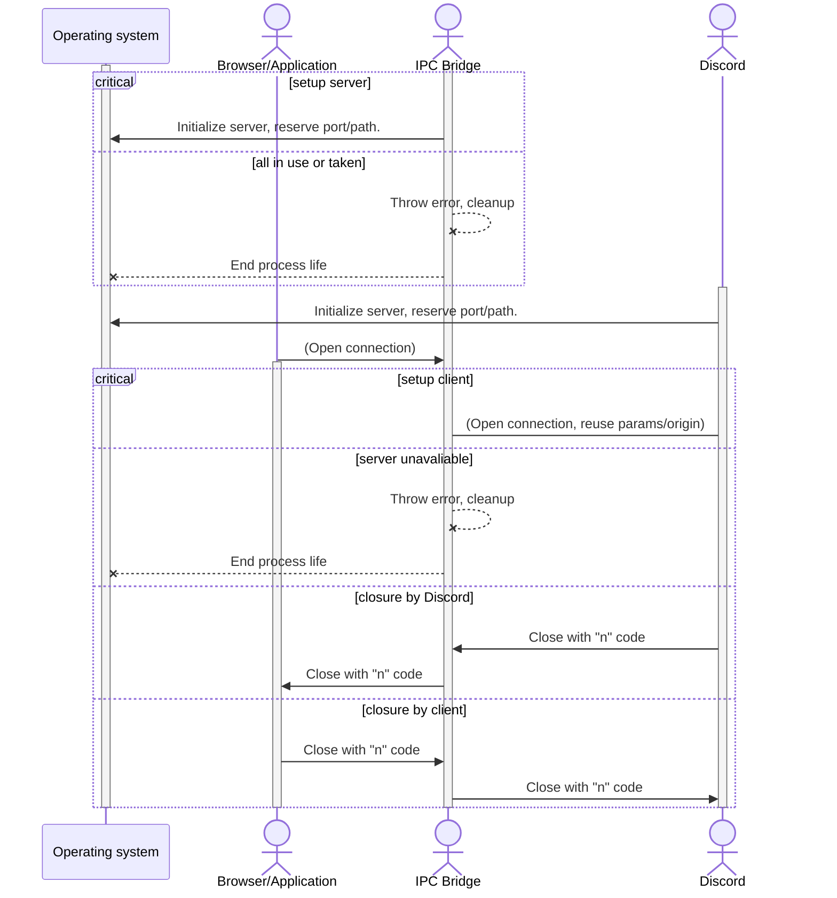

# discord-ipc-proxy

A tool to analyze the Discord's IPC/WebSocket communication between server and
client.

## Status

Currenly this tool is a bit experimental. Some things like crashes when proxy
couldn't find the socket or port of Discord server might occur and even Discord
on its own might crash it uppon first launch. Those cases might be properly
handled in the future.

Additionally, IPC proxying has not yet been tested, so it is unknown whenever
it actually works or not. WebSocket proxying should be fully functional.

## Usage

1. Clone this repo.
2. `npm i` to fetch all needed dependencies.
3. `npm start` to launch proxy.
4. Start Discord. Proxy may crash as Discord will try to communicate with it
   over IPC, but there won't be any server available to proxy.
5. `npm start` again. Everything should be working from now on, as long as
   Discord IPC/WS server is functional.

The proxy will periodically output to its STDOUT a JSON-formatted messages about
the communication between Discord IPC/WS servers and applications connecting to
them.

## About

This package was designed to help with the development of Discord WebSocket/IPC
protocol reimplementations, trying to create a universal bridge that passes
entire communication to the another client or server. A diagram showing how it
should initialize looks as below:

