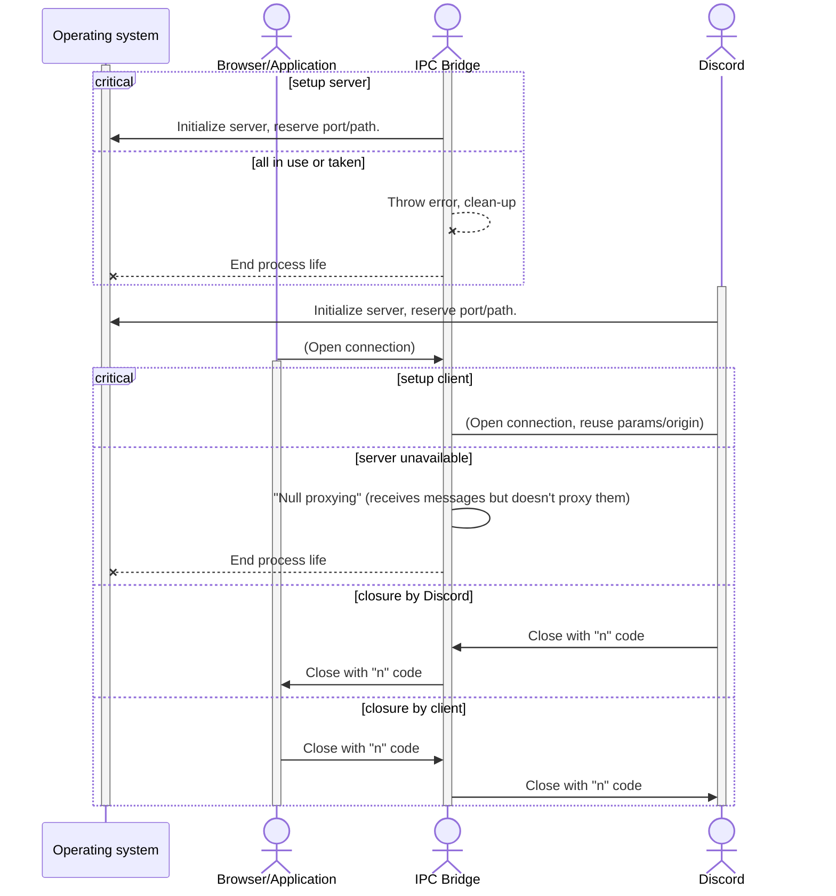

# discord-ipc-proxy

A tool to analyze the Discord's IPC/WebSocket communication between server and
client. Acts as a middleware between an application (browser, game).

## Usage

1. Clone this repo.
2. `npm i` to fetch all needed dependencies.
3. `npm start` to launch proxy.
4. Launch Discord. It shouldn't be launched **before** launching proxy.

The proxy will periodically output to its STDOUT a JSON-formatted messages about
the communication between Discord IPC/WS servers and applications connecting to
them. This can be used by 3rd-party software to visualize it in more
human-readable way (GUI, colorized CLI).

## About

This package was designed to help with the development of Discord WebSocket/IPC
protocol reimplementations, trying to create a universal bridge that passes
entire communication to the another client or server. A diagram showing how it
should initialize looks as below:

